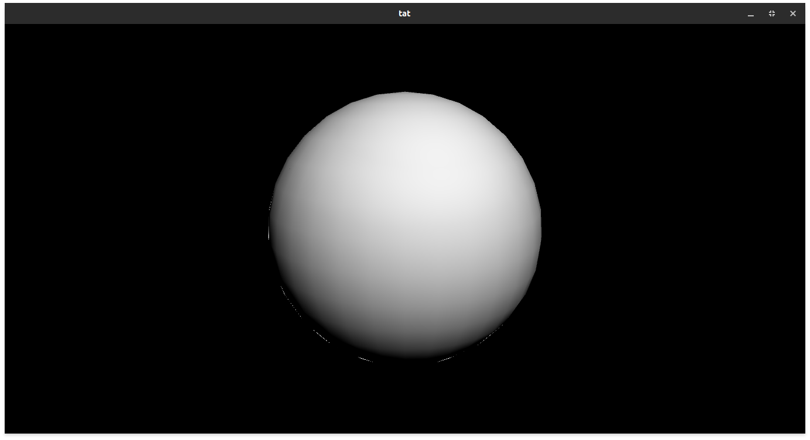
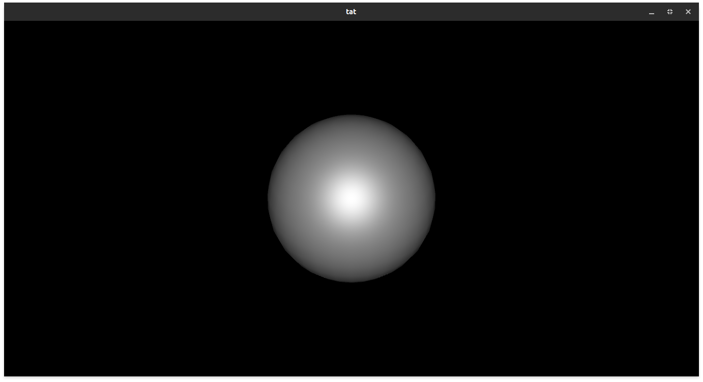
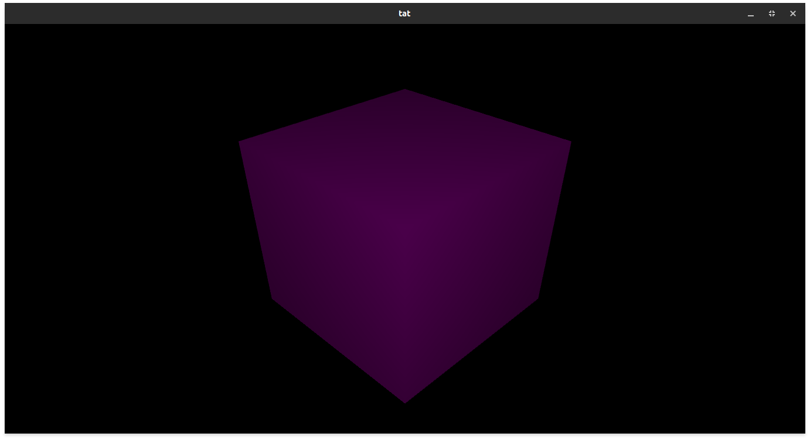

# the-ancient-tri
A low level OpenGL render engine

## Features
- Import Meshes from disk with ``Mesh`` class (Assimp supported formats only)
- Pure Lambert shading model
- Blinn-Phong shading model
- Oren-Nayar shading model
- User-defined Shaders can be added by extending ``Shader`` or ``BRDFShader`` class as needed

# ScreenShots




## Building
Using Meson, check dependencies first, build script is provided, it may not work on Windows, since it uses a Bash script, if it doesn't, write a similar batch script or whatever that works with you.

Note: if the root directory contains a file named ```main.cpp``` the build script will automatically build an executable alongside the dynamic library

## Dependencies:
- [SFML](https://www.sfml-dev.org/) (link against window and graphics modules)
- [glbinding](https://github.com/cginternals/glbinding)
- [GLM](https://github.com/g-truc/glm)
- [Assimp](https://github.com/assimp/assimp)

## Contribution
Is welcome, new shading models, coding optimizition, and new features, it is fine if you add a high level feature too.

## License
Under GPLv3, check [LICENSE](./LICENSE.md)

### Made with sick-of-college kittens